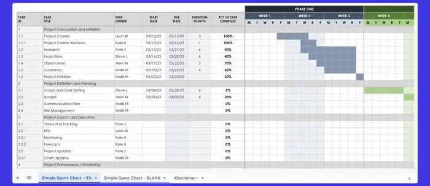

# 2025年最值得收藏的项目管理表格模板

简单项目用便签纸就够了。但任务一多、deadline一堆、团队一大,你就得找个靠谱的系统来撑场面了。这时候电子表格就派上用场了——它能把时间线、任务和资源都装进一个地方,看着就踏实。

个人和团队都喜欢用表格,因为它既灵活又有结构。今天我们就来看看那些真正好用的项目管理表格模板——顺便介绍一个能让你的业务突破表格局限的强力工具。

---

## 甘特图模板:让复杂项目清晰可见

如果你的团队要搞定那种复杂项目,甘特图模板可能就是你要找的东西。这类表格的特点是:任务可视化、时间线清楚、依赖关系一目了然。

### 1. 简单实用的甘特图入门模板

如果你之前没用过甘特图,这个模板是个不错的起点。简单好用,能分享,没有那些让人头大的多余功能。

这个Excel模板是给中型公司设计的,把任务分成"项目启动""项目规划"这样的清楚阶段。每个任务都有负责人,责任到人。

进度条和完成百分比让你一眼就能看出任务状态,方便你调整优先级。

### 2. 适合小团队的直观甘特图

如果你的团队喜欢简单直接的方式,这个模板正合适。和第一个详细列出"项目启动"那些阶段不同,这个更注重灵活性和自定义。

它提供了一个干净的项目看板,你可以按自己的工作流程把任务分类。蓝色条显示任务时间线,帮团队识别重叠或优先级,不会搞得太复杂。

用这个模板,你能跟踪完成百分比、分配资源、盯着deadline。适合需要清晰结构但不想被细节淹没的团队。

### 3. 详细的项目计划模板

要规划冲刺或功能发布?这个项目计划模板提供了一种结构化的方式来管理任务和时间线。和前面那些关注分类或灵活性的不同,这个结构跟踪计划进度和实际进度的对比。

这个Excel模板包含详细的看板,沿着结构化的时间线监控活动。"计划开始时间""计划持续时间""实际开始时间""实际持续时间"这些字段能突出显示计划和现实之间的差异。

百分比显示任务完成水平,让团队能处理延迟或优先考虑快完成的任务。时段列显示活动进展,提供项目的清晰概览。

---

## 看板模板:可视化你的工作流

看板模板用"待办""进行中""已完成"这样的列来可视化组织任务。这种板式布局让管理工作流和跟踪结果变得容易。特别适合软件开发或营销活动。

### 4. 彩色编码的看板表格

喜欢敏捷工作流?这个看板式项目管理模板给你的任务带来清晰度和结构。它把工作组织成清楚的部分:Backlog、To Do、In Progress和Test/Verify,帮你跟踪进度、有效排优先级。

"Research""Feature""Content"这样的彩色标签让分类变简单,而优先级列(低、中、高)和估计点数简化了工作量管理。

把想法或未来任务存在Backlog里,在To Do部分列出sprint优先级,在In Progress阶段规划活动任务。在Excel和Google Sheets里都能轻松自定义,这个用户友好的模板方便团队实时协作。

### 5. 便签卡风格的看板仪表盘

如果你更喜欢用视觉化方式管理项目,这个看板式表格用的布局能在项目时间线上组织任务。

它有"Backlog""To Do""In Progress""Testing"和"Complete"这些列。每个任务卡包含关键细节,比如状态、分配的团队成员和工作量点数,方便清楚地管理任务。

模板还包含一个汇总部分,显示整体进度、项目持续时间和团队成员分配。不仅适合项目经理,也适合需要实用方式来关注大局的团队。

### 6. 多项目状态报告模板

当你需要一个简单的方式来管理项目,不想搞得太复杂时,这个项目状态报告模板正合适。它避开了过度复杂的列,专注于提供快速更新和高效的任务跟踪。

模板把任务分成清楚的部分:Backlog、Active、Development、Testing、Deployment和Complete。每个任务显示为彩色编码的卡片,便于组织,下面列出分配的团队成员。

👉 [想要更强大的项目管理和数据采集能力?](https://www.scraperapi.com/?fp_ref=coupons)

它也很适合跟踪多个项目——为管理各种工作流的团队提供灵活性和结构。

---

## 项目时间线模板:把项目拆解成清晰步骤

项目时间线模板适合需要把项目分解成清楚、可管理步骤并设定明确时间框架的项目经理。

### 7. 详细的项目时间线模板

觉得长期项目需要过于复杂的工具?这个模板挑战这个观念。它是为跨越多个月的项目设计的,提供了一种结构化的方式来按季度跟踪进度。

模板把工作分成项目构思、自动化测试、规划和执行这样的阶段。每个季度用独特的颜色突出显示,创建一个视觉指南让你的团队保持一致。预填充的阶段提供起点,但你可以根据具体项目需求定制它们。

### 8. 时间线项目管理Excel模板

这个项目进度模板是管理小项目或应对紧deadline的实用选择。它专注于按周或按月跟踪进度,提供简洁的概览。

模板分成项目阶段,避免不必要的复杂性,同时仍然提供结构化的时间线视图。虽然它没有内置的任务分配列,但你可以根据需要添加它们来指定责任。

### 9. 长期时间线项目管理模板

这个项目工作流模板在Canva上可用,把工作组织成季度和年度,包含规划、策略和开发这样的阶段,是可视化长期项目的有用工具。

不过,因为Canva主要是设计平台,它缺少专用项目规划工具的功能。和Excel模板不同,它不能和其他Microsoft工具集成,这可能限制它在复杂工作流中的实用性。但它仍然是创建视觉上吸引人的工作流概览的可靠选择。

### 10. 条形图时间线模板

如果能把条形图的清晰度和详细的任务分解结合起来会怎样?这个项目时间线模板正是这么做的。它用彩色条表示任务,让你一眼就能看出进度、重叠和deadline。

"概念开发""系统设计""详细设计"这样的类别把任务分成清楚的部分,有明确的开始和结束日期。图表和下面的任务表无缝链接,你在那里输入日期、类别和任务名称这些关键细节。

一旦更新,图表就自动调整。颜色突出显示项目的不同阶段,条的高度和位置说明任务持续时间。

---

## 仪表盘项目管理模板:数据可视化的力量

如果你是视觉思考者(像65%的人那样),仪表盘项目管理模板可能正是你需要的。它们把原始数据转化为易懂的视觉效果,让你能一眼跟踪进度、发现问题。

仪表盘把一切都显示在一个地方——什么按计划进行、什么延迟了、哪里可能出现瓶颈拖慢进度——帮你用最小的努力保持控制。

### 11. 预算相关的仪表盘模板

和基础的项目管理模板不同,这个仪表盘提供项目的完整视图,非常适合任务和预算管理。

它的核心是详细的任务列表,分配责任、优先级和当前状态——无论是完成、进行中还是逾期。

任务表下面,彩色饼图显示整体任务进度,突出显示什么在正轨上、什么需要关注。预算监督由条形图确保,它比较计划和实际成本。待处理事项部分(比如决策或变更请求)让未解决的问题保持可见。

### 12. 纯图表项目管理模板

你可以用这个仪表盘来掌握优先级和预算。它用时间线和彩色编码的状态显示每个任务的项目进度。

时间线下面,饼图一眼显示任务状态和优先级。条形图比较计划和实际预算,提供清晰的财务表现视图,不用切换到预算表格。

待处理事项(比如决策和请求)有自己的部分。

---

## 用Capsule CRM自动化项目管理

项目管理不只是在表格上勾掉任务那么简单。Capsule CRM把项目管理集成到你的CRM里——创建一个单一平台来集中你团队的努力。

Capsule CRM简化工作流,提供实时可见性,在一个系统中连接销售、服务和项目交付。

**为什么Capsule CRM在项目管理上胜过电子表格?**

- **集中的项目数据**:Capsule把所有项目相关信息——时间线、预算和沟通——组织在一个可访问的平台上
- **任务管理**:使用Tracks分配任务、设置优先级和自动化工作流——这是一系列预定义的步骤,确保每个项目的一致性和清晰进度
- **实时可见性**:Capsule提供仪表盘,让团队能监控项目状态、识别瓶颈、一眼看到任务进度
- **移动灵活性**:Capsule的移动应用确保你的团队即使在外也能记录数据、更新任务和访问项目历史
- **集成工作流**:Capsule与Google Workspace、Outlook和会计软件等工具集成

👉 [开始使用Capsule的免费版本,用14天免费试用探索高级功能,告别电子表格](https://www.scraperapi.com/?fp_ref=coupons)

---

从详细的甘特图表格到简单的看板,项目管理模板提供各种方式来组织任务、时间线和预算。这些模板适合喜欢手动规划和跟踪以保持项目正轨的团队。

但有时候,电子表格不够用:Capsule CRM超越了模板,把项目管理和强大的CRM功能结合起来。它不只是让你管理项目——它让整个业务流程都顺畅起来。
